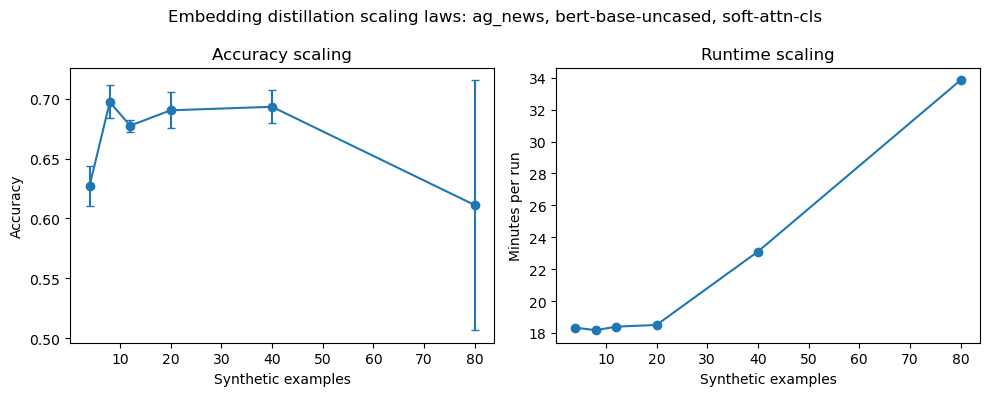

# Embedding distillation: краткий отчет

## Что такое embedding distillation

Embedding distillation - это вариант dataset distillation, где вместо выбора реальных текстов или генерации новых текстовых примеров оптимизируется маленький набор синтетических представлений во входном embedding-space модели. Идея в том, чтобы подобрать такие обучаемые embedding-векторы, метки и дополнительные сигналы обучения, чтобы модель после нескольких шагов fine-tuning на этом компактном наборе показывала качество, близкое к обучению на полном датасете.

В этом эксперименте рассматривался подход из статьи **Dataset Distillation with Attention Labels for Fine-tuning BERT**: вместе с синтетическими embedding-примерами используются soft labels и attention labels. Статья: https://aclanthology.org/2023.acl-short.12/

## Эксперимент

Метод оказался существенно дороже coreset-бейзлайнов: каждый запуск требует оптимизировать синтетические embeddings через вложенный цикл обучения, где модель многократно обучается на синтетическом наборе и валидируется на реальных данных. Поэтому эксперимент был запущен в облегченной конфигурации по сравнению с основной статьей: меньше бюджет оптимизации и уже сетка настроек. Из-за этого качество ожидаемо ниже, чем в результатах статьи.

Запуск был ограничен одной моделью, одним датасетом и одним режимом:

- датасет: `AG News`;
- модель: `bert-base-uncased`;
- режим: `soft-attn-cls`, то есть soft labels и attention labels только для CLS-токена;
- DPC grid: `1, 2, 3, 5, 10, 20`;
- для каждого DPC было сделано 5 запусков.

## Результаты

По графику и метрикам не видно понятного scaling law: рост числа синтетических примеров не дает монотонного улучшения accuracy или macro-F1. Accuracy держится примерно в районе 0.68-0.70 для 8-40 синтетических примеров, а на 80 примерах даже падает и имеет большой разброс. При этом runtime растет заметно и почти монотонно: примерно от 18 минут на маленьких DPC до 34 минут на 80 синтетических примерах.

Вероятная причина отсутствия гладкого scaling law в том, что здесь размер синтетического набора меняется одновременно со сложностью оптимизационной задачи. При большем DPC становится больше обучаемых embedding-векторов и attention/label-параметров, но бюджет оптимизации остается ограниченным; поэтому дополнительная емкость не успевает хорошо обучиться. На качество также сильно влияет нестабильность bi-level optimization: инициализация синтетических примеров, порядок батчей, шум в fine-tuning BERT и малое число outer updates могут давать эффект сильнее, чем сам рост DPC. Для soft-attn-cls режима это особенно заметно, потому что attention labels добавляют дополнительный сигнал, но при недостаточном compute он может быть плохо согласован с task loss.

## Вывод

Embedding distillation выглядит более выразительным методом, чем простые coreset-бейзлайны, потому что он учит не только выборку примеров, но и сами представления, soft labels и attention supervision. Однако в текущем облегченном запуске метод не показывает устойчивого масштабирования качества с ростом DPC. Для честной проверки scaling laws нужен более дорогой запуск: больше outer steps, несколько моделей/датасетов, сравнение режимов attention labels и отдельная проверка чувствительности к seed.
